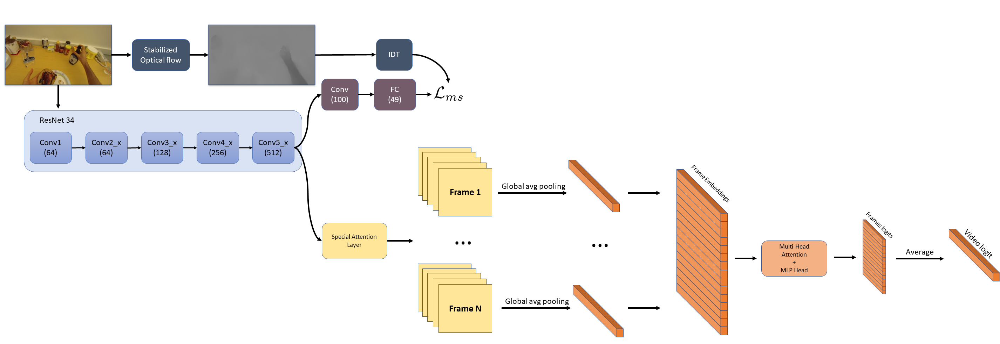

# Machine Learning and Deep Learning Project on First Person Action Recognition

This git contains the source code associated with our project, built upon the papers:

* ["Attention is All We Need: Nailing Down Object-centric Attention for Egocentric Activity Recognition"](https://arxiv.org/pdf/1807.11794.pdf)
* ["Self-Supervised Joint Encoding of Motion and Appearance for First Person Action Recognition"](https://arxiv.org/pdf/2002.03982.pdf)

The variation we propose is to replace the ConvLSTM, which is largely used in First Person Action Recognition, with a transformer, that has had a great success in Natural Language Processing, and now is being explored as an option in Computer Vision. The paper is available [here](https://github.com/gioele-scaletta/ML-DL-FPAR/blob/main/variation/project_paper.pdf)

## Architecure

## Visualization of the CAM improvement with and without the self-supervised task
RGB Attention  |  SS_Task
:-------------------------:|:-------------------------:
| 

## Note
- main_new_transformer.py is for concatenated CAM and predited motion maps.
- main_transformer_two_stages.py is without concatenation, with and without the self-supervised task.

## Comparison with 7 frames
 **Configurations**            | **MParams** | **GMACS** | **Accuracy (%)** 
-------------------------------|-------------|-----------|------------------
 ConvLSTM SS\-regression       | 40\.73      | 32\.17    | 68\.1            
 Transformer CAM attention     | 51\.23      | 25\.75    | 65\.51           
 Transformer concat SS and CAM | 57\.15      | 25\.79    | 59\.48           

